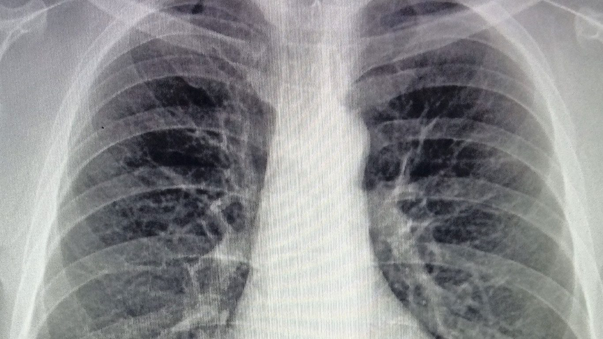
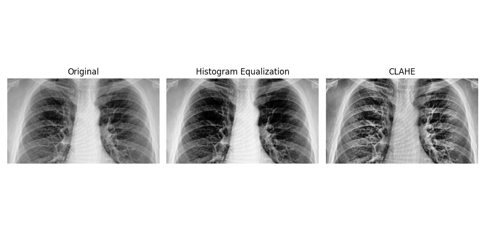
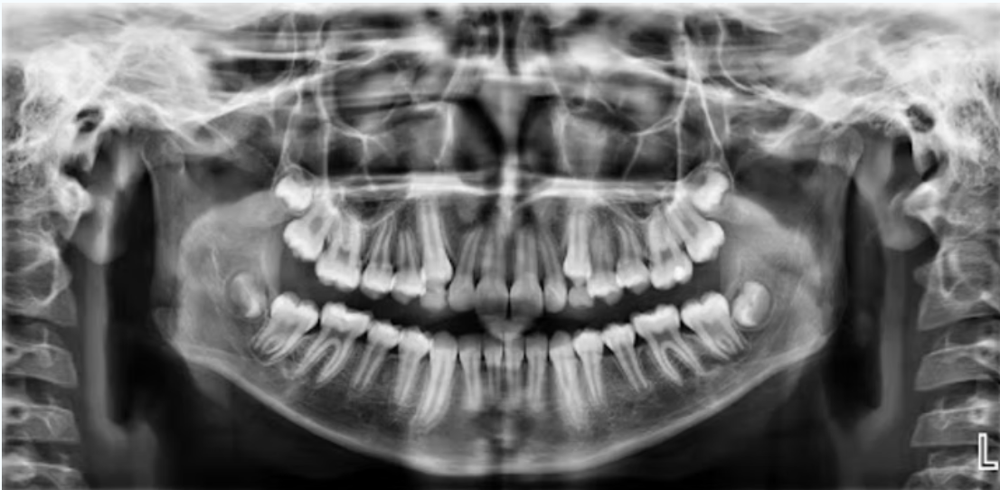
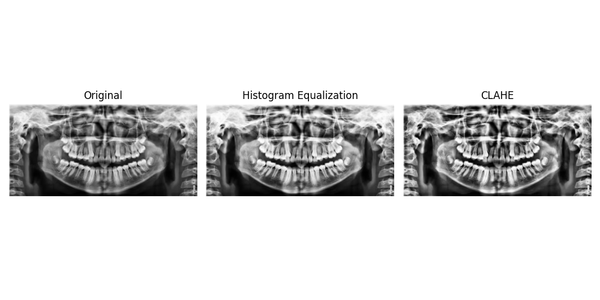

# Filtro de Convolución - Contrast Enhancement

## Descripción del Proyecto

Este proyecto implementa un filtro de convolución en Python para mejorar el contraste de una imagen. Utiliza operaciones de procesamiento digital de imágenes para resaltar los detalles visuales y mejorar la calidad de la imagen original.

## Estructura del Proyecto

```
resources/
│── Figure_1.png  # Resultado del filtro aplicado a 'radio.jpg'
│── Figure_2.png  # Resultado del filtro aplicado a 'boca.png'
│── boca.png      # Imagen de prueba
│── radio.jpg     # Imagen de prueba
│── FiltroConvolucion.py  # Script principal
│── README.md  # Documentación
```

## Instalación y Ejecución

### Requisitos Previos

Asegúrate de tener instalado Python y las siguientes librerías:

```sh
pip install numpy opencv-python matplotlib
```

### Ejecución del Proyecto

Para ejecutar el código y aplicar el filtro a una imagen, usa el siguiente comando en la terminal:
https://github.com/fernando-cb12/ProjectTC1001S/edit/A01255376/README.md
```sh
python FiltroConvolucion.py
```

El script tomará una imagen de prueba, aplicará el filtro de convolución y generará las salidas en la carpeta `resources/`.

## Fundamentos Teóricos - Convolución y Mejora de Contraste

El filtro de convolución es una operación matemática utilizada en el procesamiento de imágenes para modificar ciertas características de la imagen, como el contraste o la detección de bordes. En este caso, se implementa un **filtro de realce de contraste**, el cual enfatiza las diferencias entre las regiones claras y oscuras de una imagen.

**Definición de Convolución**:
La convolución en procesamiento de imágenes se define como:

\[ I'(x,y) = \sum*{i=-k}^{k} \sum*{j=-k}^{k} I(x+i, y+j) \cdot K(i,j) \]

donde:

- \( I(x,y) \) es la imagen original,
- \( K(i,j) \) es el kernel (matriz de convolución),
- \( I'(x,y) \) es la imagen resultante.

El kernel utilizado en este proyecto resalta los bordes y mejora la percepción de detalles en la imagen.

## Casos de prueba

### Caso #1

- Entrada  
  

- Salida  
    

### Caso #2

- Entrada  
  

- Salida  
  

## Bibliografía

- Soto Quirós, J. P. (n.d.). Convolución matricial aplicada al procesamiento de imágenes. Instituto Tecnológico de Costa Rica. Retrieved from https://www.tec.ac.cr/sites/default/files/media/doc/presentacion_pablosoto.pdf  

- Jagatheeswari, R., & Kumar, P. (2020). Contrast enhancement for medical images based on Fuzzy c-means clustering and dynamic histogram equalization. Semantic Scholar. Retrieved from https://www.semanticscholar.org/paper/Contrast-enhancement-for-medical-images-based-on-by-Jagatheeswari-Kumar/acc2fc612b195b1e96e12dc3d7eb9a92ae543286

## Colaboradores

- **Antonio Jesús Calderón Burgos** - A01255264
- **Fernando Camou Bejarano** - A01255376
- **Marco Antonio Ibarra Yedra** - A01253370
- **Luis Carlos Mares Rivera** - A01255399
